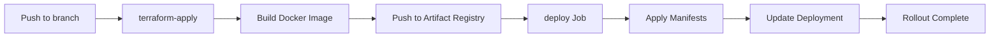

# gke-cluster-demo

## Overview

This project demonstrates how to deploy and manage a Kubernetes cluster on Google Kubernetes Engine (GKE) using Infrastructure as Code (IaC) tools with a hybrid approach: Terraform manages infrastructure while Kubernetes manifests manage application deployments.

## Features

- **Automated GKE cluster provisioning** with Terraform
- **Kubernetes manifest-based deployments** for applications
- **Blue/Green deployment pattern** for zero-downtime releases
- **Security-hardened configurations** with least-privilege access
- **Kustomize support** for environment-specific configurations
- **Validation tools** for manifests before deployment
- **Integration with Google Cloud CLI and kubectl**
- **Development Vault Deployment** (optional)
- **Prometheus Monitoring Stack Deployment** (optional)
- **Scripts for docker image generation** and upload to Google Artifact Registry (GAR)
- **Helper scripts** for common operations
- **Guidance for authentication** and access control

## Prerequisites

- GCP account with appropriate permissions
- [Terraform](https://www.terraform.io/) (v1.0+)
- [Google Cloud SDK](https://cloud.google.com/sdk/docs/install) (gcloud CLI configured with credentials)
- [Docker](https://docs.docker.com/engine/install/)
- [kubectl](https://kubernetes.io/docs/tasks/tools/)
- [Helm](https://helm.sh/) (optional, for Prometheus, Grafana, and Vault stacks)

## Usage

### Option 1: Terraform-managed (Infrastructure + Applications)

1. **Clone the repository:**

```sh
git clone https://github.com/your-org/gke-cluster-demo.git
cd gke-cluster-demo
```

1. **Configure GCP credentials:**

```sh
gcloud auth login
gcloud config set project "${PROJECT_ID}"
```

1. **Create the GKE cluster and deploy manifests:**

```sh
make install-tools
make tf-bootstrap
make tf-apply
```

1. **Access the cluster:**

```sh
make update-kubeconfig
kubectl get nodes
```

### Option 2: Hybrid Approach (Terraform for Infrastructure, Manifests for Apps)

## Recommended for production use

1. **Clone the repository:**

```sh
git clone https://github.com/your-org/gke-cluster-demo.git
cd gke-cluster-demo
```

1. **Configure GCP credentials:**

```sh
gcloud auth login
gcloud config set project "${PROJECT_ID}"
```

1. **Provision GKE cluster with Terraform:**

```sh
make install-tools
make tf-bootstrap
make tf-apply
```

1. **Update kubeconfig:**

```sh
make update-kubeconfig
```

1. **Deploy application using manifests:**

```sh
# Validate manifests
make k8s-validate

# Deploy
make k8s-apply

# Check status
make k8s-status
```

1. **Access the application:**

```sh
kubectl get service hello-world-service -n hello-world-ns
# Access via the external IP shown
```

## Quick Reference

### Terraform Commands

```sh
make tf-bootstrap     # Initialize and validate Terraform
make tf-plan          # Preview infrastructure changes
make tf-apply         # Apply infrastructure changes
make tf-destroy       # Destroy all infrastructure (with confirmation)
make tf-output        # Display Terraform outputs
make tf-state         # List Terraform state resources
```

### Kubernetes Manifest Commands

```sh
make k8s-validate         # Validate manifests (client-side)
make k8s-validate-server  # Validate against cluster (server-side)
make k8s-apply            # Deploy all manifests
make k8s-status           # Check deployment status
make k8s-logs             # View application logs
make k8s-describe         # Describe deployment details
make k8s-restart          # Restart deployment
make k8s-delete           # Delete all manifests (with confirmation)
```

### Kustomize Commands

```sh
make k8s-kustomize-validate # Validate kustomize configuration
make k8s-kustomize-apply    # Deploy with kustomize
make k8s-kustomize-diff     # Preview changes
make k8s-kustomize-delete   # Delete resources
```

### Blue/Green Deployment Commands

```sh
make bg-deploy           # Deploy blue/green infrastructure
make bg-status           # Check deployment status
make bg-switch-blue      # Switch traffic to blue
make bg-switch-green     # Switch traffic to green
make bg-rollback         # Rollback to previous version
make bg-test-blue        # Port-forward to blue deployment
make bg-test-green       # Port-forward to green deployment
make bg-logs-blue        # View blue deployment logs
make bg-logs-green       # View green deployment logs
make bg-cleanup          # Delete blue/green resources
```

### Utility Commands

```sh
make help                # Show all available commands
make check-gcp           # Verify GCP credentials
make install-tools       # Install required tools
make update-kubeconfig   # Update kubectl configuration
```

### Common Issues

**Pods not starting:**

```sh
kubectl describe pod <pod-name> -n hello-world-ns
kubectl logs <pod-name> -n hello-world-ns
```

**LoadBalancer not provisioning:**

```sh
kubectl describe service hello-world-service -n hello-world-ns
# Check load balancer in GCP Console
```

## Deployment Strategies

This project supports multiple deployment strategies to fit different use cases:

### 1. Rolling Update (Default)

Located in `manifests/` directory. Best for:

- Development environments
- Simple updates with backward compatibility
- Resource-constrained environments

```sh
make k8s-apply          # Deploy with rolling updates
make k8s-restart        # Restart deployment
```

### 2. Blue/Green Deployment

Located in `manifests/blue-green/` directory. Best for:

- Production environments
- Zero-downtime deployments
- Quick rollback capability
- Major version changes

```sh
# Deploy blue/green infrastructure
make bg-deploy

# Check status
make bg-status

# Switch to new version (green)
make bg-switch-green

# Instant rollback if needed
make bg-rollback
```

**Key Benefits:**

- ✅ **Zero Downtime** - Traffic switches instantly between versions
- ✅ **Fast Rollback** - Revert to previous version in seconds
- ✅ **Full Testing** - Test new version before exposing to users
- ✅ **Reduced Risk** - Both versions run simultaneously

See [docs/blue-green-deployment.md](docs/blue-green-deployment.md) for detailed guide.

## Project Structure

```text
gke-cluster-demo/
├── .github/                                    # GitHub configurations
│   └── workflows/                              # GitHub Actions workflows
│       ├── gke-deploy.yml                      # Main deployment pipeline
│       └── destroy-logic.yml                   # Reusable destroy condition workflow
├── ansible/                                    # Ansible configuration (optional)
│   ├── ansible.cfg                             # Ansible settings
│   ├── inventory.gcp.yaml                      # GCP inventory
│   └── test.yaml                               # Test playbook
├── app/                                        # Docker build context (renamed from kube/)
│   ├── Dockerfile                              # Container image definition
│   ├── index.html                              # Application HTML
│   └── nginx.conf                              # Nginx configuration
├── docs/                                       # Documentation
│   ├── kubernetes-deployment-guide.md          # Kubernetes deployment guide
│   ├── blue-green-deployment.md                # Blue/Green deployment guide
│   └── blue-green-quick-reference.md           # Blue/Green quick reference
├── manifests/                                  # Kubernetes YAML manifests
│   ├── hello-world-ns.yaml                     # Namespace definition
│   ├── hello-world-deployment.yaml             # Deployment with security hardening
│   ├── hello-world-service.yaml                # LoadBalancer service
│   ├── kustomization.yaml                      # Kustomize configuration
│   └── blue-green/                             # Blue/Green deployment manifests
│       ├── hello-world-ns.yaml                 # Namespace for blue/green
│       ├── hello-world-deployment-blue.yaml    # Blue deployment
│       ├── hello-world-deployment-green.yaml   # Green deployment
│       ├── hello-world-service.yaml            # Service with version selector
│       └── kustomization.yaml                  # Kustomize for blue/green
├── scripts/                                    # Automation scripts
│   ├── blue-green-switch.sh                    # Blue/Green deployment switcher
│   ├── docker-image.sh                         # Build and push Docker images
│   ├── fetch-ip.py                             # Get LoadBalancer IP (Python)
│   ├── fetch-ip.sh                             # Get LoadBalancer IP (Shell)
│   ├── fwd-services.sh                         # Port forwarding for services
│   ├── install-tools.py                        # Install required tools (Python)
│   ├── install-tools.sh                        # Install required tools (Shell)
│   ├── update-kubeconfig.py                    # Update kubectl config (Python)
│   ├── update-kubeconfig.sh                    # Update kubectl config (Shell)
│   └── update-manifest-image.sh                # Update Docker image in manifests
├── terraform/                                  # Infrastructure as Code
│   ├── backend.tf                              # GCS backend configuration
│   ├── buckets.tf                              # GCS buckets for storage
│   ├── certs.tf                                # Certificate management
│   ├── deploys.tf                              # Kubernetes deployments (Terraform-managed)
│   ├── gke.tf                                  # GKE cluster configuration
│   ├── iam.tf                                  # IAM roles and policies
│   ├── keys.tf                                 # KMS encryption keys
│   ├── locals.tf                               # Local variables
│   ├── logging.tf                              # Cloud Logging configuration
│   ├── monitoring.tf                           # Prometheus/Grafana (optional)
│   ├── outputs.tf                              # Output values
│   ├── providers.tf                            # GCP, Kubernetes providers
│   ├── variables.tf                            # Input variables
│   ├── vault.tf                                # HashiCorp Vault (optional)
│   ├── versions.tf                             # Provider version constraints
│   └── vpc.tf                                  # VPC and networking
├── .envrc                                      # direnv environment variables
├── .gitignore                                  # Git ignore patterns
├── Makefile                                    # Build automation and task runner
├── pyproject.toml                              # Python project configuration
└── README.md                                   # This file
```

## CI/CD with GitHub Actions

The project includes automated deployment workflows that mirror the pattern used in the [AWS EKS cluster demo](https://github.com/adamrocha/eks-cluster-demo) for consistency across cloud providers.

### Workflow Overview

The deployment pipeline consists of two main jobs:

1. **terraform-apply** - Provisions GKE infrastructure and builds Docker image
2. **deploy** - Applies Kubernetes manifests and updates deployment

### Automated Deployment Flow



### Branch Strategy

- **`main`** - Production environment
- **`stage`** - Staging environment
- **`dev`** - Development environment

### Infrastructure Cleanup

Delete branches prefixed with `delete/` or `nuke/` to trigger automatic infrastructure destruction:

```bash
# Create temporary environment
git checkout -b delete/testing
git push origin delete/testing

# When done, delete the branch to trigger cleanup
git push origin --delete delete/testing
```

This will:

1. Delete Kubernetes resources
2. Destroy Terraform infrastructure
3. Require manual approval via `destroy-approval` environment

### Required GitHub Secrets

Configure in **Settings → Secrets and variables → Actions**:

| Secret       | Description                      |
| ------------ | -------------------------------- |
| `GCP_SA_KEY` | JSON key for GCP service account |

### Required GitHub Variables

Configure in **Settings → Secrets and variables → Actions → Variables**:

| Variable           | Example            | Description              |
| ------------------ | ------------------ | ------------------------ |
| `GCP_PROJECT_ID`   | `"${PROJECT_ID}"`  | Your GCP project ID      |
| `GCP_REGION`       | `us-central1`      | GCP region for resources |
| `GKE_CLUSTER_NAME` | `gke-cluster-demo` | Name of your GKE cluster |

### Deployment Pattern

The workflow uses the same deployment pattern as the EKS demo:

```yaml
# Apply manifests
kubectl apply -f manifests/hello-world-ns.yaml
kubectl apply -f manifests/hello-world-deployment.yaml
kubectl apply -f manifests/hello-world-service.yaml

# Update deployment image
kubectl set image deployment/hello-world \
  -n hello-world-ns \
  hello-world=us-central1-docker.pkg.dev/PROJECT/REPO/IMAGE:TAG

# Wait for rollout with automatic rollback on failure
kubectl rollout status deployment/hello-world -n hello-world-ns
```

### Concurrency Control

The workflow prevents simultaneous deployments to the same branch:

```yaml
concurrency:
  group: terraform-${{ github.ref_name }}
  cancel-in-progress: true
```

### For Complete Details

See **[docs/github-actions-workflow-guide.md](docs/github-actions-workflow-guide.md)** for:

- Detailed job descriptions
- Deployment flow diagrams
- Destroy workflow logic
- Error handling and rollback
- Comparison with EKS workflow
- Troubleshooting guide

## Documentation

- **[docs/github-actions-workflow-guide.md](docs/github-actions-workflow-guide.md)** - CI/CD pipeline and GitHub Actions workflow guide
- **[docs/kubernetes-deployment-guide.md](docs/kubernetes-deployment-guide.md)** - Detailed Kubernetes deployment documentation
- **[docs/blue-green-deployment.md](docs/blue-green-deployment.md)** - Blue/Green deployment pattern guide
- **[docs/blue-green-quick-reference.md](docs/blue-green-quick-reference.md)** - Quick reference for blue/green deployments
- **Makefile** - Run `make help` to see all available commands

## Security Features

- **Least-privilege IAM policies** - Resource-scoped permissions
- **Security contexts** - Run containers as non-root (UID 10001)
- **Read-only root filesystem** - Container security hardening
- **KMS encryption** - For GKE secrets and Cloud Storage
- **VPC-scoped security** - Network isolation
- **Image scanning** - Automated vulnerability scanning in GAR
- **Immutable image tags** - Prevents tag overwrite; CI skips build/push when the configured tag already exists
- **Drop capabilities** - Remove unnecessary Linux capabilities

## Monitoring and Logging (Optional)

- **Prometheus Stack** - Metrics collection and alerting
- **Grafana** - Visualization dashboards
- **Cloud Logging** - Centralized logging
- **Cloud Monitoring** - Infrastructure monitoring

## Troubleshooting

**Verify image repository:**

```sh
gcloud artifacts docker images list \
  us-central1-docker.pkg.dev/"${PROJECT_ID}"/hello-world-repo
```

**Check node permissions:**

```sh
kubectl describe node | grep serviceAccount
```

**Terraform state lock issues:**

```sh
# Remove stale locks if needed
gcloud storage rm gs://$(TF_STATE_BUCKET)/.terraform.lock.hcl
```

## Cleanup

To delete all resources:

```sh
# Recommended: Delete K8s resources first, then infrastructure
make k8s-delete
make tf-destroy

# This will:
# 1. Prompt for K8s resource deletion confirmation
# 2. Delete manifests (services, deployments, namespaces)
# 3. Prompt for Terraform infrastructure deletion confirmation
# 4. Destroy GKE cluster, VPC, and all GCP resources
```

**Note:** The destroy process includes confirmations to prevent accidental deletions.

## Contributing

1. Fork the repository
2. Create a feature branch
3. Make your changes
4. Validate with `make k8s-validate` and `terraform validate`
5. Test the deployment
6. Submit a pull request

## License

This project is provided as-is for educational and demonstration purposes.
