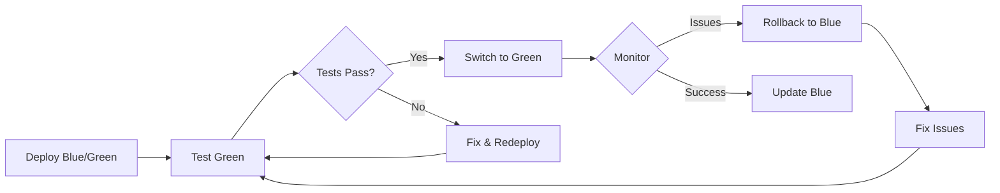

# Blue/Green Deployment Quick Reference

## Quick Commands

### Deploy

```sh
make bg-deploy                 # Deploy blue/green infrastructure
```

### Switch Traffic

```sh
make bg-switch-blue            # Switch to blue
make bg-switch-green           # Switch to green
make bg-rollback               # Rollback to previous version
```

### Check Status

```sh
make bg-status                 # View deployment status
kubectl get svc hello-world-service -n hello-world-ns -o jsonpath='{.spec.selector.version}'
```

### Testing

```sh
make bg-test-blue              # Port-forward to blue (localhost:8080)
make bg-test-green             # Port-forward to green (localhost:8081)
```

### Logs

```sh
make bg-logs-blue              # View blue logs
make bg-logs-green             # View green logs
```

### Cleanup

```sh
make bg-cleanup                # Delete all blue/green resources
```

## Workflow



## Manual Switch Commands

### Switch to Blue

```sh
kubectl patch service hello-world-service -n hello-world-ns \
  -p '{"spec":{"selector":{"version":"blue"}}}'
```

### Switch to Green

```sh
kubectl patch service hello-world-service -n hello-world-ns \
  -p '{"spec":{"selector":{"version":"green"}}}'
```

## Check Which Version is Active

```sh
# Quick check
kubectl get svc hello-world-service -n hello-world-ns \
  -o jsonpath='{.spec.selector.version}'

# Detailed check
kubectl describe svc hello-world-service -n hello-world-ns | grep version
```

## Update Image Version

### Update Green Deployment

```sh
# Edit the manifest
vi manifests/blue-green/hello-world-deployment-green.yaml

# Or use script
./scripts/update-manifest-image.sh hello-world-repo 1.2.6 green

# Apply
kubectl apply -f manifests/blue-green/hello-world-deployment-green.yaml

# Wait for rollout
kubectl rollout status deployment/hello-world-green -n hello-world-ns
```

## Testing Checklist

- [ ] Green pods are running: `kubectl get pods -n hello-world-ns -l version=green`
- [ ] Readiness probe passing: `kubectl describe pod <green-pod> -n hello-world-ns`
- [ ] Port-forward test: `make bg-test-green` → `curl localhost:8081`
- [ ] Health endpoint: `curl localhost:8081/health` (if available)
- [ ] Logs clean: `make bg-logs-green`
- [ ] Load test passed: `hey -z 30s -c 50 http://localhost:8081/`

## Rollback

```sh
# Instant rollback
make bg-rollback

# Or manually
CURRENT=$(kubectl get svc hello-world-service -n hello-world-ns -o jsonpath='{.spec.selector.version}')
if [ "$CURRENT" = "green" ]; then
  make bg-switch-blue
else
  make bg-switch-green
fi
```

## Troubleshooting

### Pods Not Ready

```sh
kubectl get pods -n hello-world-ns -l version=green
kubectl describe pod <pod-name> -n hello-world-ns
kubectl logs <pod-name> -n hello-world-ns
```

### Service Not Routing

```sh
kubectl get endpoints hello-world-service -n hello-world-ns
kubectl describe svc hello-world-service -n hello-world-ns
```

### Image Not Pulling

```sh
gcloud artifacts docker images list \
  us-central1-docker.pkg.dev/gke-cluster-458701/hello-world-repo
```

## Resource Cleanup

### After Successful Deployment

```sh
# Scale down old version (keep for rollback)
kubectl scale deployment hello-world-blue -n hello-world-ns --replicas=1

# Or delete old version
kubectl delete deployment hello-world-blue -n hello-world-ns
```

### Full Cleanup

```sh
# Delete everything
make bg-cleanup

# Or manually
kubectl delete -k manifests/blue-green/
```

## Key Metrics to Monitor

- Pod status: `kubectl get pods -n hello-world-ns`
- Resource usage: `kubectl top pods -n hello-world-ns`
- Events: `kubectl get events -n hello-world-ns --sort-by='.lastTimestamp'`
- Service endpoint: `kubectl get svc hello-world-service -n hello-world-ns`
- Logs: `kubectl logs -f -n hello-world-ns -l version=green`

## Safety Checklist

- [ ] Blue deployment is healthy and serving traffic
- [ ] Green deployment is deployed and pods are ready
- [ ] Green deployment tested via port-forward
- [ ] Monitoring/alerting is active
- [ ] Rollback plan is clear
- [ ] Team is notified
- [ ] Off-hours deployment (if critical)
- [ ] Database migrations (if any) are backward-compatible

## Next Steps

See [blue-green-deployment.md](blue-green-deployment.md) for detailed guide.
