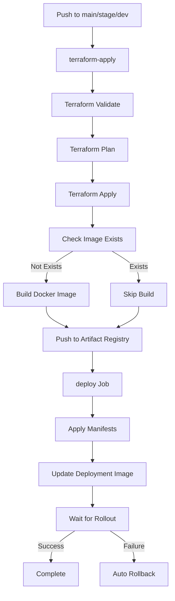
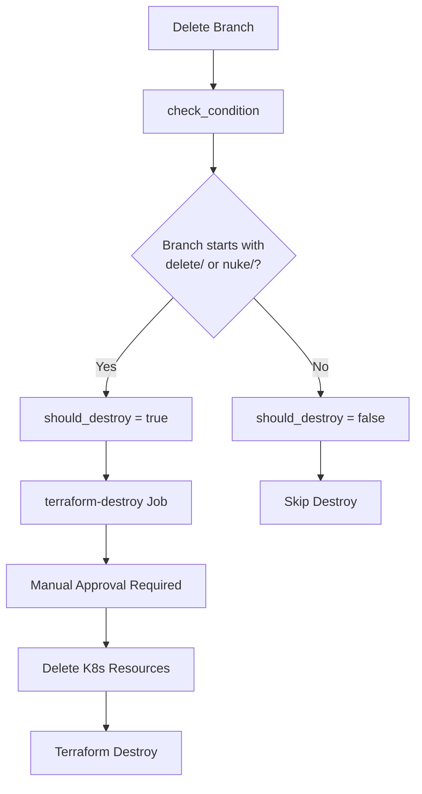

# GitHub Actions Workflow Guide

## Overview

The GKE deployment workflow follows the same pattern as the EKS cluster demo for consistency and ease of maintenance across AWS and GCP environments.

## Workflow Structure

### Main Workflow: `gke-deploy.yml`

#### Jobs

1. **terraform-apply** - Provision Infrastructure
   - Validates and applies Terraform configuration
   - Builds and pushes Docker image to Artifact Registry
   - Runs on: `push` to main/stage/dev, `pull_request`
   - Dependencies: None
2. **deploy** - Update Deployment
   - Applies Kubernetes manifests
   - Updates deployment image using `kubectl set image`
   - Waits for rollout to complete with automatic rollback on failure
   - Dependencies: Requires `terraform-apply` to complete

3. **check_condition** - Determine Destroy Eligibility
   - Calls reusable workflow `destroy-logic.yml`
   - Checks if deleted branch qualifies for infrastructure destroy
   - Runs on: `delete` events only
   - Dependencies: None

4. **terraform-destroy** - Destroy Infrastructure
   - Deletes Kubernetes resources
   - Destroys Terraform infrastructure
   - Requires manual approval via `destroy-approval` environment
   - Dependencies: Requires `check_condition.outputs.should_destroy == 'true'`

## Deployment Flow

### Standard Deployment (Push to Branch)



### Destroy Flow (Branch Deletion)



## Branch Patterns

### Deployment Branches

- `main` - Production environment
- `stage` - Staging environment
- `dev` - Development environment

### Destroy Triggers

Deleting branches with these prefixes triggers infrastructure destruction:

- `delete/*` - Explicitly marked for deletion
- `nuke/*` - Alternative deletion trigger

**Example:**

```bash
# Create a temporary environment
git checkout -b delete/testing-feature
git push origin delete/testing-feature

# Trigger destroy by deleting the branch
git push origin --delete delete/testing-feature
```

## Environment Variables

### Required Secrets

Set in GitHub repository settings → Secrets and variables → Actions:

- `GCP_SA_KEY` - JSON key for GCP service account with permissions:
  - Compute Admin
  - Kubernetes Engine Admin
  - Storage Admin
  - Artifact Registry Administrator
  - Cloud KMS Admin

### Required Variables

Set in GitHub repository settings → Secrets and variables → Actions → Variables:

- `GCP_PROJECT_ID` - Your GCP project ID (e.g., `my-gke-project`)
- `GCP_REGION` - GCP region (e.g., `us-central1`)
- `GKE_CLUSTER_NAME` - Name of the GKE cluster (e.g., `gke-cluster-demo`)

### Workflow Environment Variables

Defined in `gke-deploy.yml`:

```yaml
env:
  GCP_PROJECT_ID: ${{ vars.GCP_PROJECT_ID }}
  GCP_REGION: ${{ vars.GCP_REGION }}
  GKE_CLUSTER_NAME: ${{ vars.GKE_CLUSTER_NAME }}
  NAMESPACE: hello-world-ns
  IMAGE_NAME: hello-world
  REPO_NAME: hello-world-repo
  IMAGE_TAG: 1.2.5
  TERRAFORM_VERSION: "1.13.1"
  PYTHON_VERSION: "3.11"
```

## Deployment Pattern

### kubectl apply + set image

This pattern matches the EKS workflow and provides:

1. **Declarative State**: Applies manifests to ensure desired state
2. **Image Update**: Updates deployment image to trigger rollout
3. **Automatic Rollback**: Reverts to previous version on failure

```bash
# Apply manifests
kubectl apply -f manifests/hello-world-ns.yaml
kubectl apply -f manifests/hello-world-deployment.yaml
kubectl apply -f manifests/hello-world-service.yaml

# Update image
kubectl set image deployment/hello-world \
  -n hello-world-ns \
  hello-world=us-central1-docker.pkg.dev/PROJECT_ID/REPO/IMAGE:TAG

# Wait for rollout
kubectl rollout status deployment/hello-world -n hello-world-ns
```

### Why Not Kustomize?

While the manifests support Kustomize (`kubectl apply -k manifests/`), the workflow uses explicit `kubectl apply` for:

- **Consistency**: Matches EKS deployment pattern
- **Clarity**: Each resource application is visible in logs
- **Control**: Easier to debug and understand execution flow
- **Flexibility**: Simpler to add conditional logic per resource

## Concurrency Control

```yaml
concurrency:
  group: terraform-${{ github.ref_name }}
  cancel-in-progress: true
```

- Prevents multiple deployments to the same branch simultaneously
- Cancels in-progress runs when new push occurs
- Each branch has independent deployment queue

## Caching Strategy

### Terraform Plugin Cache

```yaml
cache:
  path: ~/.terraform.d/plugin-cache
  key: terraform-${{ runner.os }}-${{ hashFiles('**/*.tf') }}
```

Reduces Terraform init time by caching provider plugins.

### Docker Build Cache

```yaml
cache-from: type=gha
cache-to: type=gha,mode=max
```

Uses GitHub Actions cache for Docker layer caching, significantly speeding up builds.

## Error Handling

### Deployment Failures

The deploy job includes automatic rollback:

```yaml
if ! kubectl rollout status deployment/hello-world -n hello-world-ns --timeout=300s; then
kubectl rollout undo deployment/hello-world -n hello-world-ns
exit 1
fi
```

### Destroy Safety

- Requires manual approval via `destroy-approval` environment
- Only triggers for specific branch prefixes
- Protected branches (main/stage/dev) never auto-destroy

## Reusable Workflow: `destroy-logic.yml`

### Purpose

Determines if a branch deletion event should trigger infrastructure destruction.

### Inputs

- `branch_prefixes` - Comma-separated list of qualifying prefixes (default: `delete/,nuke/`)

### Outputs

- `should_destroy` - Boolean indicating if destroy should proceed

### Usage

```yaml
check_condition:
  if: github.event_name == 'delete'
  uses: ./.github/workflows/destroy-logic.yml
  with:
    branch_prefixes: delete/,nuke/,temp/
```

## Comparison: GKE vs EKS Workflows

| Aspect              | EKS Workflow                                                | GKE Workflow                                |
| ------------------- | ----------------------------------------------------------- | ------------------------------------------- |
| **Jobs**            | terraform-apply, deploy, check_condition, terraform-destroy | Same                                        |
| **Auth**            | AWS credentials via OIDC                                    | GCP service account JSON key                |
| **Kubeconfig**      | `aws eks update-kubeconfig`                                 | `gcloud container clusters get-credentials` |
| **Registry**        | Amazon ECR                                                  | Google Artifact Registry                    |
| **Docker Auth**     | `aws ecr get-login-password`                                | `gcloud auth configure-docker`              |
| **Deployment**      | kubectl apply + set image                                   | Same                                        |
| **Destroy Trigger** | Branch prefixes: delete/, nuke/                             | Same                                        |
| **Concurrency**     | terraform-${{ github.ref_name }}                            | Same                                        |

## Best Practices

### Branch Management

1. **Feature Development**: Use standard branch names (feature/, fix/)
2. **Temporary Environments**: Use delete/ or nuke/ prefix for auto-cleanup
3. **Long-lived Environments**: Use main, stage, dev (protected)

### Image Versioning

1. **Semantic Versioning**: Update IMAGE_TAG in workflow env (e.g., 1.2.5)
2. **SHA Tags**: Consider using git SHA for traceability
3. **Latest Tag**: Automatically applied alongside version tag

### Terraform State

1. **Remote Backend**: GCS bucket configured in `backend.tf`
2. **State Locking**: Enabled by default with GCS
3. **State Inspection**: Use `terraform state list` locally

### Security

1. **Least Privilege**: Service account has minimal required permissions
2. **Secret Rotation**: Rotate GCP_SA_KEY regularly
3. **Environment Protection**: Use GitHub environments for production
4. **Image Scanning**: Consider adding Trivy or similar scanner

## Troubleshooting

### Deployment Stuck

```bash
# Check pod status
kubectl get pods -n hello-world-ns -o wide

# View pod logs
kubectl logs -n hello-world-ns -l app=hello-world --tail=50

# Check events
kubectl get events -n hello-world-ns --sort-by='.lastTimestamp'
```

### Image Pull Errors

```bash
# Verify image exists
gcloud artifacts docker images list us-central1-docker.pkg.dev/PROJECT_ID/hello-world-repo

# Check image tag
gcloud artifacts docker images describe \
  us-central1-docker.pkg.dev/PROJECT_ID/hello-world-repo/hello-world:1.2.5
```

### Terraform State Lock

```bash
# List locks (if any)
gsutil ls gs://YOUR_BUCKET/terraform/state/**

# Force unlock (use carefully)
terraform force-unlock LOCK_ID
```

## Examples

### Deploying a New Version

1. Update image tag in `gke-deploy.yml`:

   ```yaml
   IMAGE_TAG: 1.2.6
   ```

2. Push to dev branch:

   ```bash
   git add .github/workflows/gke-deploy.yml
   git commit -m "Bump image version to 1.2.6"
   git push origin dev
   ```

3. Monitor deployment:
   - GitHub Actions tab shows progress
   - terraform-apply builds and pushes new image
   - deploy updates deployment and waits for rollout

### Creating Temporary Environment

```bash
# Create and push delete-prefixed branch
git checkout -b delete/test-new-feature
git push origin delete/test-new-feature

# Work on your changes...

# Clean up (triggers destroy workflow)
git push origin --delete delete/test-new-feature
```

### Manual Destroy

For branches without delete/nuke prefix:

```bash
# Locally
make k8s-delete
make terraform-destroy

# Or via GitHub UI
# 1. Go to Actions tab
# 2. Manually trigger destroy workflow (if configured)
```

## Next Steps

- [Kubernetes Deployment Guide](./kubernetes-deployment-guide.md)
- [Blue-Green Deployment](./blue-green-deployment.md)
- [Project README](../README.md)
